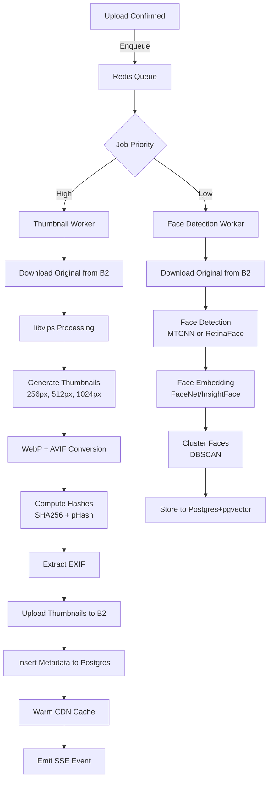

# Image Processing Pipeline

## Overview

The processing pipeline handles thumbnail generation, format conversion, deduplication, EXIF extraction, and optional face recognition. All operations are idempotent and resumable.

## Architecture



## Thumbnail Specifications

### Sizes & Formats

| Variant | Longest Edge | WebP (quality 85) | AVIF (quality 75) | JPEG Fallback |
|---------|--------------|-------------------|-------------------|---------------|
| thumb_256 | 256px | ✅ Default | ✅ Modern browsers | ✅ Legacy |
| thumb_512 | 512px | ✅ Default | ✅ Modern browsers | ✅ Legacy |
| thumb_1024 | 1024px | ✅ Default | ✅ Modern browsers | ✅ Legacy |

**Format Selection Logic (Client-Side)**:
```javascript
const supportsAVIF = await checkAVIFSupport(); // via <picture> or canvas test
const supportsWebP = await checkWebPSupport();
const format = supportsAVIF ? 'avif' : (supportsWebP ? 'webp' : 'jpeg');
const thumbUrl = `/thumb/${photoId}/${size}.${format}`;
```

**Why these sizes?**
- 256px: Grid thumbnails (2x2 or 3x3 layout on mobile)
- 512px: Single photo preview on mobile, grid on desktop
- 1024px: Full-screen preview on desktop (retina displays)

### Conversion Settings

**Library**: libvips 8.14+ (C library with Python bindings: `pyvips 2.2+`)

**Thumbnail generation command**:
```python
import pyvips

def generate_thumbnail(input_path: str, output_path: str, size: int, format: str):
    image = pyvips.Image.new_from_file(input_path, access='sequential')
    
    # Auto-rotate based on EXIF orientation
    image = image.autorot()
    
    # Scale to fit within size (longest edge)
    scale = size / max(image.width, image.height)
    if scale < 1:
        image = image.resize(scale, kernel='lanczos3')
    
    # Format-specific options
    if format == 'webp':
        image.write_to_file(output_path, Q=85, strip=True)
    elif format == 'avif':
        image.write_to_file(output_path, Q=75, speed=6, strip=True)
    else:  # jpeg
        image.write_to_file(output_path, Q=90, optimize_coding=True, strip=False)
```

**Performance**: libvips processes 10 MP image (3 thumbnails × 3 formats = 9 outputs) in **~500ms** on 4-core CPU.

**Alternative**: sharp (Node.js) if using Node workers instead of Python (similar performance).

## Deduplication Strategy

### Exact Duplicates (SHA256)

1. **Client-side hash**: Browser computes SHA256 using Web Crypto API before upload
2. **Pre-upload check**: `/api/upload/presign` queries `SELECT photo_id FROM photos WHERE sha256=$1 AND user_id=$2`
3. **Action**: Return 409 Conflict with existing photo_id; user chooses to skip or add as reference

**Storage savings**: Eliminates redundant storage; only metadata is duplicated.

### Perceptual Duplicates (pHash)

1. **Compute pHash**: imagehash library (`pip install imagehash`)
   ```python
   import imagehash
   from PIL import Image
   
   phash = imagehash.phash(Image.open(file_path), hash_size=8)  # 64-bit hash
   phash_int = int(str(phash), 16)  # Convert to BIGINT for Postgres
   ```

2. **Near-duplicate detection**: After upload, query for similar pHash (Hamming distance < 10)
   ```sql
   SELECT photo_id, BIT_COUNT(phash # $1::bigint) as distance
   FROM photos
   WHERE user_id = $2 AND phash IS NOT NULL
   HAVING BIT_COUNT(phash # $1::bigint) < 10;
   ```

3. **User action**: Show UI: "3 similar photos found. Merge or keep separate?"

**Tradeoff**: pHash is approximate; Hamming distance 10 catches ~95% of duplicates (minor edits, crops) but may have false positives (~2%).

**Alternative**: Use dHash (difference hash) or aHash (average hash) if pHash has too many false positives.

## EXIF Extraction

**Library**: exiftool (CLI) or Pillow (Python)

**Preferred**: exiftool for reliability (handles more camera models)
```bash
exiftool -json -d "%Y-%m-%d %H:%M:%S" image.jpg
```

**Extracted fields**:
- **Date**: `DateTimeOriginal`, `CreateDate` (fallback), `ModifyDate`
- **GPS**: `GPSLatitude`, `GPSLongitude`, `GPSAltitude`
- **Camera**: `Make`, `Model`, `LensModel`
- **Settings**: `ISO`, `FNumber` (aperture), `ExposureTime` (shutter), `FocalLength`

**GPS reverse geocoding**: Use Nominatim API (OpenStreetMap) to get location name
```python
import requests

def reverse_geocode(lat, lng):
    url = f"https://nominatim.openstreetmap.org/reverse?lat={lat}&lon={lng}&format=json"
    resp = requests.get(url, headers={'User-Agent': 'PhotoBomb/1.0'})
    data = resp.json()
    return data.get('display_name')  # e.g., "San Francisco, California, USA"
```

**Rate limit**: Nominatim allows 1 req/sec; batch process with Redis queue.

**Alternative**: Google Maps Geocoding API (paid, but more accurate for rural areas).

## Face Recognition Pipeline (Opt-In Only)

### Detection & Embedding

**Model**: InsightFace ArcFace (RetinaFace for detection + ArcFace for embeddings)

**Why InsightFace?**
- State-of-art accuracy (99.8% on LFW benchmark)
- 512-dim embeddings (compact for pgvector)
- Fast inference: ~50ms per face on CPU, ~5ms on GPU

**Installation**:
```bash
pip install insightface onnxruntime-gpu
```

**Code**:
```python
import insightface
from insightface.app import FaceAnalysis

app = FaceAnalysis(providers=['CUDAExecutionProvider', 'CPUExecutionProvider'])
app.prepare(ctx_id=0, det_size=(640, 640))

def detect_faces(image_path: str):
    img = cv2.imread(image_path)
    faces = app.get(img)
    
    results = []
    for face in faces:
        results.append({
            'bbox': face.bbox.tolist(),  # [x1, y1, x2, y2]
            'embedding': face.embedding.tolist(),  # 512-dim float32 array
            'confidence': float(face.det_score)
        })
    return results
```

### Clustering Faces (Grouping by Person)

**Algorithm**: DBSCAN (Density-Based Spatial Clustering)

**Why DBSCAN?**
- No need to specify number of clusters (unlike K-means)
- Handles outliers (e.g., strangers in background)

**Parameters**:
- `eps=0.4`: Max cosine distance to be considered same person (tune based on dataset)
- `min_samples=3`: Minimum 3 faces to form a cluster

**Code**:
```python
from sklearn.cluster import DBSCAN
import numpy as np

def cluster_faces(embeddings: list):
    # embeddings is list of 512-dim vectors
    X = np.array(embeddings)
    
    # Use cosine distance (1 - cosine_similarity)
    clustering = DBSCAN(eps=0.4, min_samples=3, metric='cosine')
    labels = clustering.fit_predict(X)
    
    # labels: [0, 0, 1, -1, 2, 2, ...]
    # -1 = noise (unassigned faces)
    return labels
```

**Incremental clustering**: When new photo is uploaded, find nearest cluster using pgvector:
```sql
SELECT face_cluster_id, 
       1 - (avg_embedding <=> $1::vector) as similarity
FROM (
    SELECT face_cluster_id, 
           AVG(embedding) as avg_embedding
    FROM face_detections
    WHERE user_id = $2
    GROUP BY face_cluster_id
) clusters
ORDER BY similarity DESC
LIMIT 1;
```
If similarity > 0.6, assign to cluster; else create new cluster.

### Privacy Enforcement

**Opt-in mechanism**:
1. User enables "Face Grouping" in settings
2. `UPDATE users SET face_recognition_enabled = TRUE WHERE user_id = $1`
3. Worker checks `face_recognition_enabled` before processing

**Opt-out behavior**:
```sql
-- Delete all face data for user
DELETE FROM face_detections WHERE user_id = $1;
DELETE FROM face_clusters WHERE user_id = $1;
```

**UI Text** (for transparency):
> **Face Grouping (Optional)**
> 
> We use AI to detect and group faces in your photos, making it easier to find pictures of people you care about. Face data is stored securely and never shared.
> 
> - ✅ You can turn this off anytime, and all face data will be deleted.
> - ✅ Face grouping only works on your photos (not visible to others).
> - ✅ You control who to name and who to leave unnamed.

## Job Queue Design

### Queue Backend

**Option 1: Celery 5.3+ with Redis 7.2+** (Recommended for MVP)

**Why Celery?**
- Mature, widely-used (Django/Flask ecosystem)
- Built-in retry, rate limiting, task routing
- Flower for web UI monitoring

**Setup**:
```python
# celery_app.py
from celery import Celery

app = Celery('photobomb',
             broker='redis://localhost:6379/0',
             backend='redis://localhost:6379/1')

app.conf.update(
    task_routes={
        'tasks.generate_thumbnails': {'queue': 'high'},
        'tasks.detect_faces': {'queue': 'low'},
    },
    task_acks_late=True,  # Retry on worker crash
    worker_prefetch_multiplier=1,  # Fair distribution
)

@app.task(bind=True, max_retries=3)
def generate_thumbnails(self, upload_id: str):
    try:
        # Processing logic...
    except Exception as exc:
        raise self.retry(exc=exc, countdown=2 ** self.request.retries)
```

**Workers**:
```bash
# High-priority queue (thumbnail generation)
celery -A celery_app worker -Q high -c 8 --loglevel=info

# Low-priority queue (face detection on GPU)
celery -A celery_app worker -Q low -c 2 --loglevel=info
```

**Option 2: Temporal.io** (For complex workflows)

**Use if**: You need multi-step workflows with compensation (e.g., rollback on failure), long-running jobs (> 1hr), or versioned workflow definitions.

**Tradeoff**: Higher complexity (additional service), but better for scale (100k+ jobs/day).

### Idempotency

**Key**: Use `upload_id` as idempotency key

```python
@app.task(bind=True, max_retries=3)
def generate_thumbnails(self, upload_id: str):
    # Check if already processed
    existing_job = db.query(ProcessingJob).filter_by(
        upload_id=upload_id,
        job_type='thumbnail',
        status='completed'
    ).first()
    
    if existing_job:
        return {'status': 'already_processed', 'photo_id': existing_job.photo_id}
    
    # Proceed with processing...
```

**Prevents**: Duplicate thumbnails if job is retried after network failure.

## Monitoring & Alerts

### Metrics to Track

| Metric | Alert Threshold | Action |
|--------|-----------------|--------|
| Queue depth (high priority) | > 100 jobs for 5 min | Scale up workers (HPA) |
| Processing latency (p95) | > 60 seconds | Investigate slow jobs |
| Job failure rate | > 5% | Check error logs, rollback if regression |
| Worker CPU usage | > 90% for 10 min | Scale horizontally |
| B2 API errors | > 1% | Check B2 status, enable circuit breaker |

### Datadog/Prometheus Metrics

```python
from prometheus_client import Counter, Histogram

thumbnail_duration = Histogram('thumbnail_processing_seconds', 'Time to generate thumbnails')
job_failures = Counter('job_failures_total', 'Total failed jobs', ['job_type'])

@thumbnail_duration.time()
def generate_thumbnails(...):
    try:
        # ...
    except Exception:
        job_failures.labels(job_type='thumbnail').inc()
        raise
```

## Error Handling & Retries

### Transient Errors (Retry)

- B2 API rate limit (429): Exponential backoff 2^n seconds, max 32s
- Network timeout: Retry immediately (max 3 attempts)
- Worker OOM: Reduce batch size, retry

### Permanent Errors (Fail & Alert)

- Corrupted image file: Mark as failed, notify user
- Unsupported format: Return 400 to client (pre-upload validation)
- Quota exceeded: Block upload, notify user

### Dead Letter Queue

After 3 retries, move to DLQ for manual inspection:
```python
@app.task(bind=True, max_retries=3, default_retry_delay=60)
def generate_thumbnails(self, upload_id: str):
    try:
        # ...
    except Exception as exc:
        if self.request.retries >= self.max_retries:
            # Send to DLQ
            send_to_dlq(upload_id, exc)
            raise
        else:
            raise self.retry(exc=exc)
```

## Implementation Notes

**Why libvips over ImageMagick?**
- 4-8x faster for batch operations (streaming architecture)
- 10x lower memory usage (doesn't load entire image into RAM)
- Native support for HEIC, WebP, AVIF without external delegates

**Why InsightFace over dlib/face_recognition?**
- Higher accuracy (99.8% vs 99.3% on LFW)
- Faster inference (GPU-optimized ONNX models)
- Better handling of profile faces and occlusions

**Tradeoff: GPU workers**
- Cost: NVIDIA T4 on GCP ~$0.35/hr (preemptible)
- Benefit: 10x faster face detection (5ms vs 50ms per face)
- Recommendation: Use CPU for MVP (<1000 photos/day), GPU when scaling (>10k photos/day)

**Alternative: Client-side processing**
- Use WASM (wasm-vips) for thumbnail generation in browser
- Pro: Zero server cost for thumbnails
- Con: Battery drain on mobile, slower on low-end devices
- **Verdict**: Hybrid approach—generate 256px client-side, others server-side
