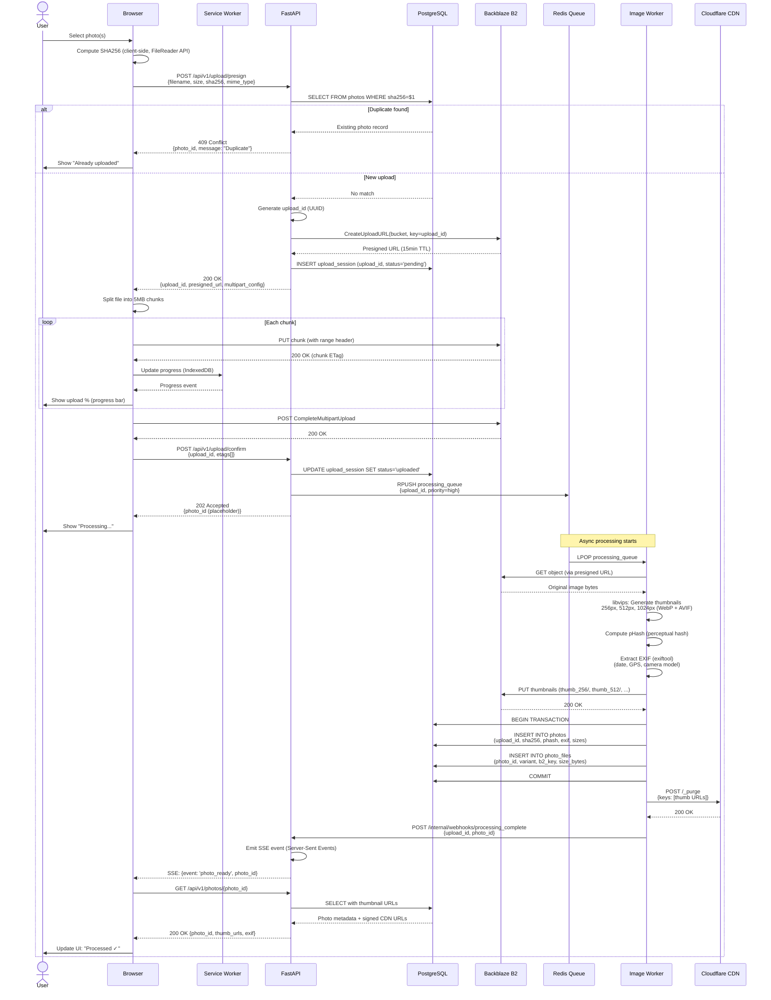
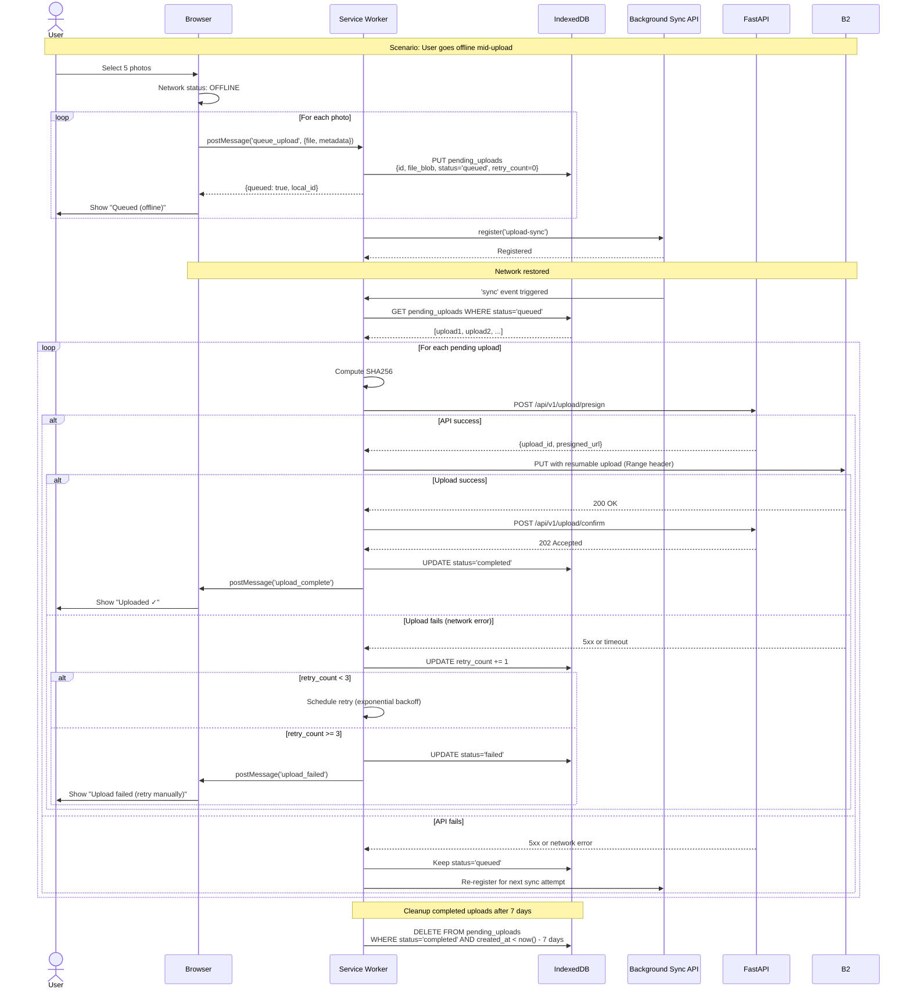
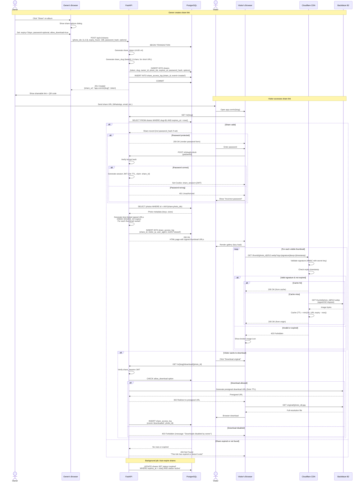

# Sequence Diagrams

## 1. Direct Browser Upload with Presigned URL

## 2. Client Sync with Offline Queue & Resume

## 3. Share Link Flow with Signed Short-Lived URLs

## Implementation Notes

### Upload Flow
- **Chunked uploads**: Split files > 5MB to support resume on network failure (AWS S3 multipart upload pattern works with B2)
- **Client-side SHA256**: Prevent duplicate uploads before sending bytes (use WebCrypto API for performance)
- **Idempotency**: `upload_id` as key ensures duplicate confirm calls don't create duplicate jobs
- **SSE for progress**: Server-Sent Events preferred over WebSocket for simple one-way updates (lower overhead)

**Alternative**: Use GraphQL subscriptions instead of SSE (more complex but unified with existing GraphQL API)

### Offline Sync Flow
- **Background Sync API**: Supported Chrome/Edge/Samsung Internet; fallback to visibility change event for iOS Safari
- **Retry strategy**: Exponential backoff 2^n seconds (max 32s) to avoid thundering herd
- **IndexedDB quota**: Request persistent storage to avoid eviction (navigator.storage.persist())
- **Tradeoff**: Full-resolution photos stored locally can fill quota fast; consider storing only metadata + thumbnail locally

**iOS Safari limitation**: Background Sync API not supported; uploads resume only when app is in foreground. Mitigation: Prompt user to keep app open during upload.

### Share Link Flow
- **Signed URLs**: HMAC-SHA256 with server secret, embed expiry timestamp to allow stateless validation at CDN edge
- **Short slugs**: base62 encoding for human-friendly URLs (e.g., app.com/s/aB3xY9k2)
- **Password hashing**: bcrypt with cost factor 12 (100-200ms to hash, defends against brute force)
- **Rate limiting**: Cloudflare Worker enforces 10 requests/min per IP on share unlock endpoint

**Security consideration**: Share JWTs are HttpOnly cookies to prevent XSS; same-site=strict to prevent CSRF

**Tradeoff**: Signed URLs expire after 1hr, requiring page refresh for long viewing sessions. Alternative: Use CDN with custom auth worker that validates against DB (higher DB load but no expiry).
