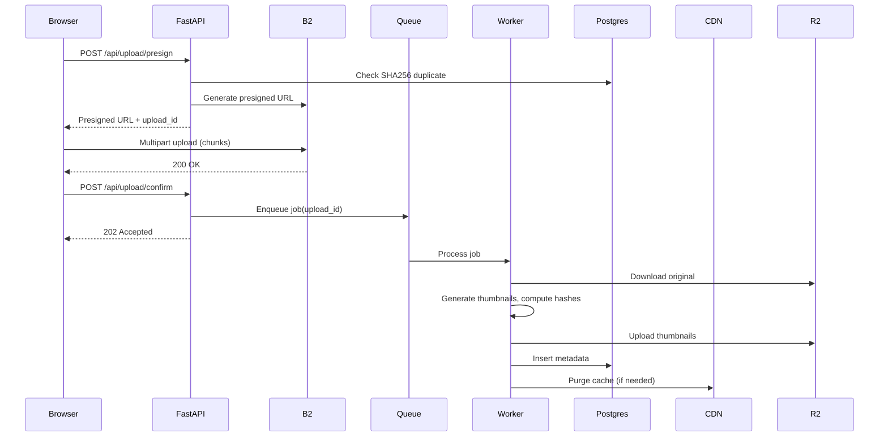
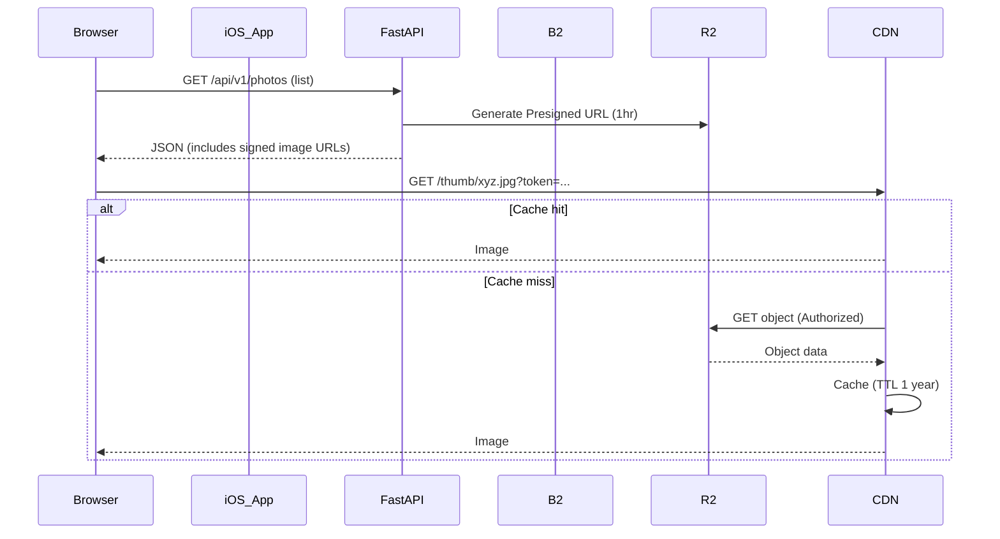
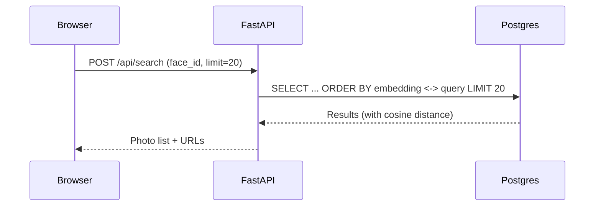

# System Architecture

## High-Level Architecture

## Components

### Client Layer (Browser/PWA)
- **React PWA** (v18.2+)
  - Service Worker for offline caching
  - IndexedDB for local metadata and upload queue
  - WebAssembly (wasm-vips) for client-side thumbnail generation fallback
- **Manifest.json** for Add-to-Home on Android/iOS
- **Background Sync API** for offline upload resume

### Edge Layer (Cloudflare)
- **CDN**: Cache thumbnails, static assets (Cache-Control: max-age=31536000 for immutable)
- **Workers**: Light transformation (resize-on-demand for share links), rate limiting, signed URL validation
- **DNS**: apex + www with CNAME to origin

### Application Layer
- **FastAPI** (v0.104+) on Python 3.11+
  - **REST APIs**: Auth, upload presign, metadata CRUD
  - **GraphQL** (Strawberry v0.209+): Complex queries (timeline, search, albums)
  - Async workers via Celery 5.3+ or Temporal.io
- **Gunicorn** with uvicorn workers (4 workers per core)
- Horizontal scaling via Kubernetes HPA (target: 70% CPU)

### Data Layer
- **PostgreSQL 16** with extensions:
  - `pgvector` (v0.5+) for face embeddings (512-dim vectors)
  - `pg_trgm` for fuzzy text search
  - `btree_gin` for composite indexes
- **Connection pooling**: PgBouncer (transaction mode, pool size = cores × 2)
- **Read replicas** for analytics and search (async replication lag < 1s)
- **Performance Optimized Indexes**:
  - `idx_tags_category`: Fast filtering for hashtags main page
  - `idx_photo_tags_tag_id`: Instant photo retrieval for specific hashtags
  - `idx_photo_tags_tag_confidence`: Ranking relevant photos within tags

### Storage Layer (Cloudflare R2)
- **Primary: Cloudflare R2** (S3-compatible)
  - Bucket: `photobomb-primary` (private)
  - Lifecycle: Keep originals indefinitely
  - Presigned uploads: 15-minute expiry, SHA256 checksum enforced
- **Zero Egress Fees**: Massive cost saving for read-heavy workload.
- **CDN**: Cloudflare integrated naturally.

### Processing Layer (K8s or server pool)
- **Image Processing Workers**
  - libvips 8.14+ (faster than ImageMagick, lower memory)
  - Thumbnail sizes: 256px, 512px, 1024px (longest edge)
  - Formats: WebP (quality 85), AVIF (quality 75) for modern browsers, JPEG fallback
- **Deduplication**
  - SHA256 for exact duplicates
  - pHash (imagehash library) for perceptual duplicates (Hamming distance < 10)
- **EXIF Extraction**: exiftool or Pillow
- **Face Embeddings** (opt-in only):
  - Model: FaceNet (512-dim) or InsightFace ArcFace
  - Batch processing via GPU workers (NVIDIA T4 or similar)
  - Store embeddings in pgvector, cluster via DBSCAN

### Job Queue
- **Celery 5.3+** with Redis 7.2+ as broker
- **Alternative**: Temporal.io for complex workflows (retry, compensation)
- **Idempotency**: Use upload_id as idempotency key
- **Queues**:
  - `high`: User-facing (thumbnail generation)
  - `low`: Background (face embeddings, ML)
  - `batch`: Bulk operations (reprocessing)
  - `cron`: Periodic tasks (Supabase keep-alive query every 2 hours)

## Data Flows

### Upload Flow

### Read Flow (Secure AOT)

**Note**: To ensure privacy, images are NOT public. The API generates temporary presigned URLs for every image.
- **Pros**: Zero public access, granular access control, offloads bandwidth to R2/CDN.
- **Cons**: Client must refresh URLs when they expire (handled by re-fetching list or specific refresh endpoint).

### Search Flow (Vector Similarity)

## Network Boundaries & Security Zones

### Public Zone
- Cloudflare CDN (only serves thumbnails, no originals)
- Static assets (CSS, JS bundles)

### Application Zone (VPC)
- FastAPI servers (internal load balancer)
- No direct internet access; egress via NAT gateway

### Data Zone (Private Subnet)
- PostgreSQL (no public IP)
- Access only from application zone via security groups

### Processing Zone (K8s Cluster)
- Workers with R2 S3-API access (Access Keys, no public access)
- GPU nodes for face processing (optional, scale to zero when idle)

## Failure Points & Mitigation

### 🔴 R2 API Rate Limits
- **Risk**: 429 errors during burst uploads
- **Mitigation**: Client-side retry with exponential backoff (2^n seconds, max 32s), queue jobs

### 🔴 PostgreSQL Connection Exhaustion
- **Risk**: Spikes cause connection pool exhaustion
- **Mitigation**: PgBouncer with transaction pooling, circuit breaker in app layer

### 🔴 Worker Queue Backlog
- **Risk**: Slow processing causes growing backlog
- **Mitigation**: HPA for workers (scale up when queue depth > 100), monitoring alert

### 🔴 CDN Cache Stampede
- **Risk**: Cache expiry causes all requests to hit origin
- **Mitigation**: Stale-while-revalidate, CDN request coalescing

### 🔴 Disk Full on Workers
- **Risk**: Processing large images fills /tmp
- **Mitigation**: Ephemeral volumes with size limits, cleanup after each job

## Implementation Notes

**Why libvips over ImageMagick?** 
- 4-8x faster for batch thumbnail generation
- Streaming architecture uses ~10x less memory
- Native WebP/AVIF support without external delegates

**Why Cloudflare R2?**
- $15/TB/month storage (vs B2 $5/TB, S3 $23/TB)
- **Zero Egress Fees**: This is the killer feature. For media apps, egress often exceeds storage cost.
- **S3 Compatibility**: Standard S3 API support allows us to use mature tools (boto3).
- **Simplicity**: One vendor (Cloudflare) for DNS, CDN, WAF, and Storage.

**Tradeoff: Higher Storage Cost ($15/TB vs $5/TB)**
- Worth it because we save cost on egress compared to AWS, and avoid complexity of B2+Cloudflare bandwidth alliance setup.

**Why pgvector over dedicated vector DB (Pinecone, Weaviate)?**
- Simpler ops: one DB instead of two
- Good enough for < 10M embeddings (HNSW index, query time < 50ms)
- Limitation: Not suitable for > 100M vectors; would need dedicated vector DB then

**Alternatives Considered**
1. **AWS S3 + CloudFront**: More mature but 4x storage cost
2. **Fly.io Postgres**: Easier managed service but limited pgvector support as of Nov 2024
3. **Cloudflare Workers for heavy processing**: 50ms CPU limit makes it unsuitable; K8s gives flexibility
