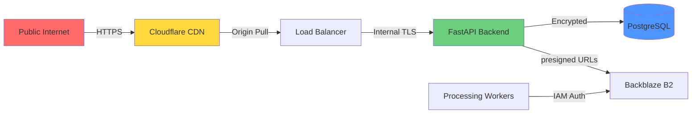
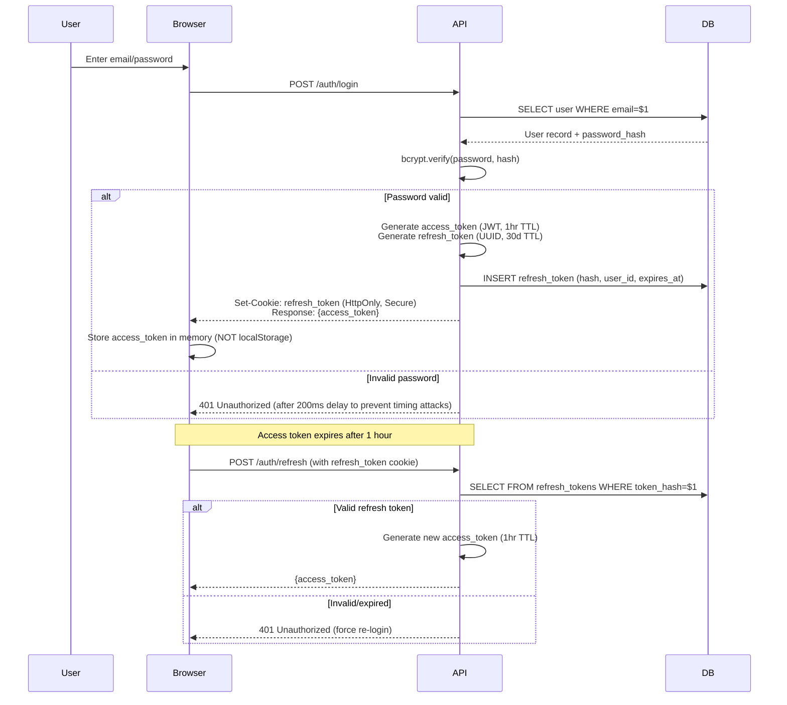
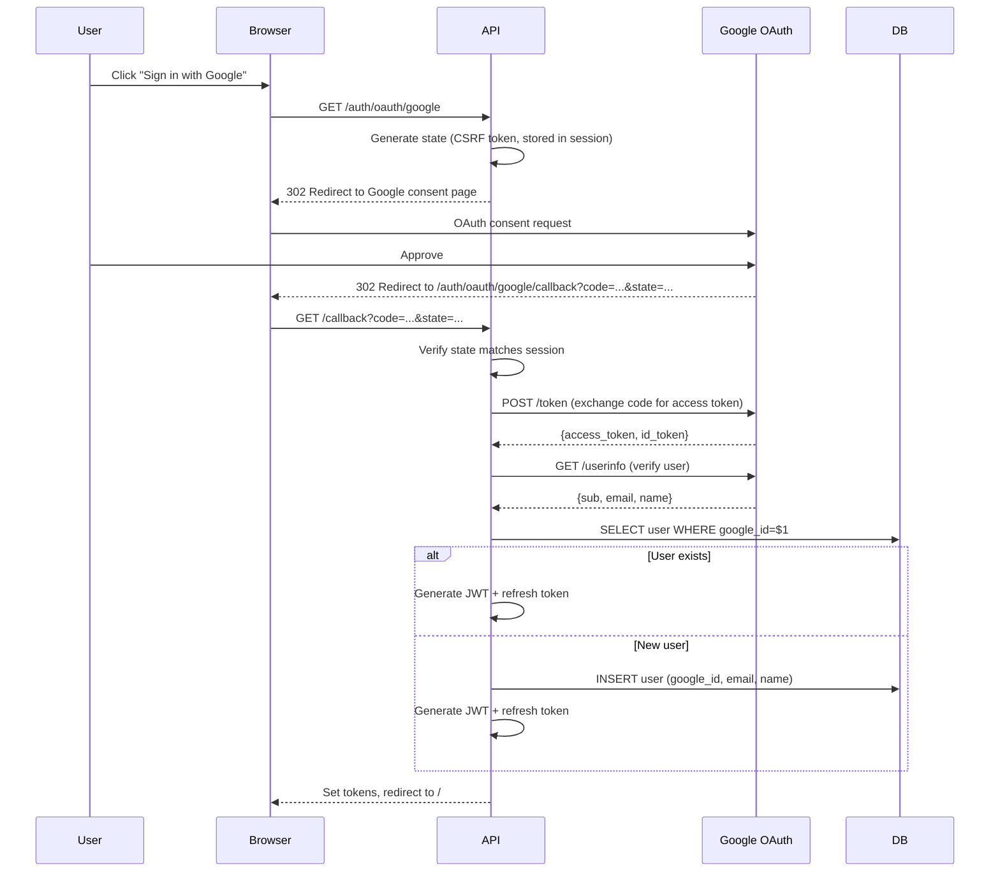

# Security & Privacy Design

## Threat Model

### Trust Boundaries



### Attack Vectors & Mitigations

| Attack Vector | Risk Level | Mitigation |
|---------------|-----------|------------|
| **SQL Injection** | High | Parameterized queries (SQLAlchemy ORM), input validation |
| **XSS (Cross-Site Scripting)** | High | CSP headers, React auto-escaping, DOMPurify for user content |
| **CSRF (Cross-Site Request Forgery)** | Medium | SameSite cookies, CSRF tokens on state-changing ops |
| **Account Takeover** | High | bcrypt (cost 12), 2FA (TOTP), rate limiting on login |
| **Brute Force Login** | Medium | Rate limit (5 attempts/15min), CAPTCHA after 3 failures |
| **Session Hijacking** | Medium | HttpOnly cookies, Secure flag, short-lived access tokens (1hr) |
| **Presigned URL Abuse** | Medium | Short expiry (15min for uploads, 5min for downloads), HMAC signatures |
| **Object Storage Enumeration** | Low | UUIDs for keys (not sequential), bucket policies (private) |
| **DoS (Denial of Service)** | Medium | Cloudflare DDoS protection, rate limiting (100 req/min/user) |
| **Malicious Image Upload** | Medium | File type validation, libvips sandboxing, size limits (50MB) |
| **Unauthorized Face Data Access** | High | Row-level security (RLS in Postgres), opt-in enforcement |

## Authentication Flows

### JWT + Refresh Token Flow



**JWT Payload**:
```json
{
  "sub": "user_id_uuid",
  "email": "user@example.com",
  "exp": 1700000000,
  "iat": 1699996400,
  "jti": "token_id_uuid",
  "face_enabled": false
}
```

**Token Security**:
- Access token: Signed with HS256 (HMAC-SHA256) using 256-bit secret
- Refresh token: Stored as SHA256 hash in DB (like passwords)
- Rotation: Refresh token rotated on each use (old token invalidated)

### OAuth 2.0 Flow (Google, Apple)



**Security Notes**:
- State parameter prevents CSRF (must match session)
- Use `nonce` in id_token for replay attack prevention
- Verify id_token signature (Google's public key via JWKS)

## Authorization & Access Control

### Row-Level Security (RLS)

PostgreSQL RLS policies ensure users can only access their own data:

```sql
-- Enable RLS on photos table
ALTER TABLE photos ENABLE ROW LEVEL SECURITY;

-- Policy: Users can only read their own photos
CREATE POLICY photos_select_own ON photos
  FOR SELECT
  USING (user_id = current_setting('app.current_user_id')::uuid);

-- Policy: Users can only insert their own photos
CREATE POLICY photos_insert_own ON photos
  FOR INSERT
  WITH CHECK (user_id = current_setting('app.current_user_id')::uuid);

-- Policy: Users can only update their own photos
CREATE POLICY photos_update_own ON photos
  FOR UPDATE
  USING (user_id = current_setting('app.current_user_id')::uuid);

-- Policy: Users can only delete their own photos
CREATE POLICY photos_delete_own ON photos
  FOR DELETE
  USING (user_id = current_setting('app.current_user_id')::uuid);

-- Set current user in session before queries
-- In FastAPI middleware:
async def set_current_user(request: Request, call_next):
    user_id = get_user_from_jwt(request.headers.get('Authorization'))
    async with db.begin():
        await db.execute(f"SET LOCAL app.current_user_id = '{user_id}'")
        response = await call_next(request)
    return response
```

### API Authorization

**FastAPI Dependency Injection**:
```python
from fastapi import Depends, HTTPException, status
from fastapi.security import HTTPBearer, HTTPAuthorizationCredentials
import jwt

security = HTTPBearer()

def get_current_user(credentials: HTTPAuthorizationCredentials = Depends(security)):
    token = credentials.credentials
    try:
        payload = jwt.decode(token, SECRET_KEY, algorithms=['HS256'])
        user_id = payload['sub']
        return user_id
    except jwt.ExpiredSignatureError:
        raise HTTPException(status_code=401, detail='Token expired')
    except jwt.InvalidTokenError:
        raise HTTPException(status_code=401, detail='Invalid token')

@app.get('/api/v1/photos')
async def list_photos(user_id: str = Depends(get_current_user)):
    photos = await db.query(Photo).filter_by(user_id=user_id).all()
    return photos
```

## Storage Encryption

### At-Rest Encryption

**Backblaze B2**: Server-side encryption (SSE-B2) enabled by default
- AES-256 encryption
- Keys managed by Backblaze
- No additional cost

**PostgreSQL**: Transparent Data Encryption (TDE) via pgcrypto
```sql
CREATE EXTENSION pgcrypto;

-- Encrypt sensitive fields (e.g., if storing payment info)
ALTER TABLE users ADD COLUMN encrypted_ssn BYTEA;

INSERT INTO users (encrypted_ssn)
VALUES (pgp_sym_encrypt('123-45-6789', 'encryption_key'));

SELECT pgp_sym_decrypt(encrypted_ssn, 'encryption_key') FROM users;
```

**Disk encryption**: Use encrypted EBS volumes (AWS) or equivalent in other clouds.

### In-Transit Encryption

- **HTTPS**: TLS 1.3 (Cloudflare CDN enforces)
- **API → DB**: TLS 1.2+ (PostgreSQL `sslmode=require`)
- **Worker → B2**: HTTPS (B2 SDK uses TLS 1.2+)

### Client-Side Encryption (Optional Advanced Feature)

**Use Case**: Users who want zero-knowledge privacy (server can't decrypt photos)

**Flow**:
1. User enables E2EE in settings, generates keypair in browser:
   ```javascript
   const keyPair = await crypto.subtle.generateKey(
     { name: 'RSA-OAEP', modulusLength: 2048, publicExponent: new Uint8Array([1, 0, 1]), hash: 'SHA-256' },
     true,
     ['encrypt', 'decrypt']
   );
   ```
2. Private key encrypted with user password (never sent to server):
   ```javascript
   const wrappedPrivateKey = await crypto.subtle.wrapKey('pkcs8', keyPair.privateKey, passwordKey, { name: 'AES-GCM', iv });
   ```
3. Public key stored on server (for sharing)
4. Before upload, encrypt photo with AES-256:
   ```javascript
   const encryptedPhoto = await crypto.subtle.encrypt({ name: 'AES-GCM', iv }, aesKey, photoBytes);
   ```
5. Upload encrypted photo; server can't decrypt

**Tradeoff**:
- ✅ Zero-knowledge privacy
- ❌ No server-side ML (thumbnails, face recognition) unless user shares decrypt key
- ❌ Complexity: Key management, recovery (if user forgets password, photos are lost)

**UI Text**:
> **End-to-End Encryption (Advanced)**
> 
> Enable zero-knowledge encryption to ensure only you can view your photos. We won't be able to:
> - Generate thumbnails (you'll see encrypted blobs)
> - Detect faces or objects
> - Recover your photos if you lose your password
> 
> This is for advanced users who prioritize privacy over convenience.

## Face Recognition Privacy

### Opt-In Enforcement

**At registration**: Default is OFF
```python
class User(Base):
    face_recognition_enabled = Column(Boolean, default=False)
```

**Before processing**:
```python
@app.task
def detect_faces(upload_id: str):
    upload = db.query(UploadSession).get(upload_id)
    user = db.query(User).get(upload.user_id)
    
    if not user.face_recognition_enabled:
        logger.info(f"Skipping face detection for user {user.user_id} (not opted in)")
        return {'status': 'skipped', 'reason': 'not_opted_in'}
    
    # Proceed with face detection...
```

### Data Retention Policy

**User deletes account**:
```sql
-- Soft delete user (30-day grace period)
UPDATE users SET deleted_at = NOW() WHERE user_id = $1;

-- After 30 days (cron job):
DELETE FROM face_detections WHERE user_id IN (
    SELECT user_id FROM users WHERE deleted_at < NOW() - INTERVAL '30 days'
);
DELETE FROM face_clusters WHERE user_id IN (
    SELECT user_id FROM users WHERE deleted_at < NOW() - INTERVAL '30 days'
);
DELETE FROM photos WHERE user_id IN (
    SELECT user_id FROM users WHERE deleted_at < NOW() - INTERVAL '30 days'
);
-- Finally, hard delete user
DELETE FROM users WHERE deleted_at < NOW() - INTERVAL '30 days';
```

**B2 object deletion**:
```python
async def delete_user_objects(user_id: str):
    photos = await db.query(PhotoFile).filter_by(user_id=user_id).all()
    for photo in photos:
        b2_client.delete_file_version(photo.b2_file_id)
```

## Rate Limiting

**Implementation**: Cloudflare Workers + Redis

**Rules**:
| Endpoint | Limit | Window |
|----------|-------|--------|
| /auth/login | 5 attempts | 15 minutes (per IP) |
| /auth/register | 3 attempts | 1 hour (per IP) |
| /upload/presign | 100 requests | 1 hour (per user) |
| /api/v1/* (authenticated) | 1000 requests | 1 hour (per user) |
| /s/* (share links) | 50 requests | 5 minutes (per IP) |

**Cloudflare Worker**:
```javascript
async function handleRequest(request) {
  const ip = request.headers.get('CF-Connecting-IP');
  const path = new URL(request.url).pathname;
  
  if (path.startsWith('/auth/login')) {
    const count = await incrementCounter(`login:${ip}`, 900); // 15 min TTL
    if (count > 5) {
      return new Response('Too many login attempts', { status: 429 });
    }
  }
  
  return fetch(request);
}

async function incrementCounter(key, ttl) {
  const value = await KV.get(key);
  const count = value ? parseInt(value) + 1 : 1;
  await KV.put(key, count.toString(), { expirationTtl: ttl });
  return count;
}
```

## Security Headers

**FastAPI Middleware**:
```python
from fastapi.middleware.cors import CORSMiddleware
from starlette.middleware.security import SecurityHeadersMiddleware

app.add_middleware(
    CORSMiddleware,
    allow_origins=['https://photobomb.app'],  # No wildcard in production
    allow_credentials=True,
    allow_methods=['GET', 'POST', 'PUT', 'DELETE', 'PATCH'],
    allow_headers=['Authorization', 'Content-Type'],
)

# Security headers
@app.middleware("http")
async def add_security_headers(request: Request, call_next):
    response = await call_next(request)
    response.headers['Strict-Transport-Security'] = 'max-age=31536000; includeSubDomains'
    response.headers['X-Content-Type-Options'] = 'nosniff'
    response.headers['X-Frame-Options'] = 'DENY'
    response.headers['X-XSS-Protection'] = '1; mode=block'
    response.headers['Referrer-Policy'] = 'strict-origin-when-cross-origin'
    response.headers['Content-Security-Policy'] = (
        "default-src 'self'; "
        "img-src 'self' https://cdn.photobomb.app data:; "
        "script-src 'self' 'unsafe-inline' https://cdn.photobomb.app; "
        "style-src 'self' 'unsafe-inline' https://fonts.googleapis.com; "
        "font-src 'self' https://fonts.gstatic.com; "
        "connect-src 'self' https://api.photobomb.app; "
        "frame-ancestors 'none';"
    )
    return response
```

## Audit Logging

**What to log**:
- User registration, login, logout
- Photo upload, delete, share creation
- Account deletion, data export requests
- Failed login attempts (for security monitoring)

**Log format (JSON)**:
```json
{
  "timestamp": "2024-12-10T22:00:00Z",
  "user_id": "uuid",
  "action": "photo_deleted",
  "resource_type": "photo",
  "resource_id": "photo_uuid",
  "ip_address": "203.0.113.1",
  "user_agent": "Mozilla/5.0...",
  "success": true
}
```

**Retention**: 1 year for audit logs, then archive to S3 Glacier

## Compliance (GDPR/CCPA)

### User Rights

| Right | Implementation |
|-------|----------------|
| **Right to Access** | `/api/v1/user/export` - Download all data as JSON/ZIP |
| **Right to Deletion** | `/api/v1/user/delete` - Soft delete (30d), then hard delete |
| **Right to Rectification** | User can edit captions, metadata via UI |
| **Right to Portability** | Export includes photos + metadata in standard format (JSON) |
| **Right to Object** | Face recognition is explicit opt-in; can be disabled anytime |

### Data Export

```python
@app.post('/api/v1/user/export')
async def export_user_data(user_id: str = Depends(get_current_user)):
    photos = await db.query(Photo).filter_by(user_id=user_id).all()
    albums = await db.query(Album).filter_by(user_id=user_id).all()
    
    export_data = {
        'user': serialize_user(user),
        'photos': [serialize_photo(p) for p in photos],
        'albums': [serialize_album(a) for a in albums],
    }
    
    # Create ZIP with photos + metadata.json
    zip_path = await create_export_zip(user_id, export_data, photos)
    
    # Send download link via email (expires in 7 days)
    await send_export_email(user.email, zip_path)
    
    return {'status': 'export_started', 'eta': '5 minutes'}
```

### Cookie Consent

**Banner** (GDPR-compliant):
```jsx
function CookieBanner() {
  return (
    <div className="cookie-banner">
      <p>
        We use cookies for authentication and analytics. 
        <a href="/privacy">Privacy Policy</a>
      </p>
      <button onClick={() => acceptCookies()}>Accept</button>
      <button onClick={() => rejectNonEssential()}>Reject Non-Essential</button>
    </div>
  );
}
```

**Categories**:
- Essential: Authentication (refresh token) - cannot be disabled
- Analytics: Cloudflare Web Analytics (privacy-friendly, no PII)
- Marketing: None (we don't use third-party ads)

## Incident Response Runbook

### Data Breach (Photos Leaked)

1. **Containment** (within 1hr):
   - Revoke compromised B2 API keys
   - Rotate database credentials
   - Enable IP whitelist on backend (temporary)

2. **Investigation** (within 24hr):
   - Check B2 access logs for unauthorized requests
   - Query audit_logs for suspicious activity
   - Determine scope: How many users affected?

3. **Notification** (within 72hr, GDPR requirement):
   - Email affected users
   - Report to data protection authority (if EU users affected)
   - Public disclosure on status page

4. **Remediation**:
   - Fix vulnerability (e.g., broken access control)
   - Deploy patch
   - Force password reset for affected users

### SQL Injection Detected

1. **Immediate**: Block malicious IP via Cloudflare firewall
2. **Code review**: Find vulnerable endpoint (likely raw SQL, not ORM)
3. **Patch**: Convert to parameterized query
4. **Deploy**: Hotfix to production within 2hr
5. **Audit**: Full code scan for similar patterns (use `semgrep`)

### DDoS Attack

1. **Cloudflare mitigates** automatically (no action needed for L3/L4)
2. If application-layer (L7): Enable "I'm Under Attack" mode
3. **Monitor**: Queue depth, DB connections, worker CPU
4. **Scale**: Horizontal autoscaling (HPA) if queue grows

## Security Testing

### Penetration Testing
- Schedule annual pentest (hire external firm)
- Focus areas: Auth, file upload, presigned URLs, SQL injection

### OWASP Top 10 Checklist
- [ ] A01:2021 – Broken Access Control → RLS policies
- [ ] A02:2021 – Cryptographic Failures → TLS everywhere, bcrypt
- [ ] A03:2021 – Injection → SQLAlchemy ORM, input validation
- [ ] A04:2021 – Insecure Design → Threat model documented
- [ ] A05:2021 – Security Misconfiguration → Security headers
- [ ] A06:2021 – Vulnerable Components → Dependabot alerts
- [ ] A07:2021 – Authentication Failures → JWT + refresh, rate limiting
- [ ] A08:2021 – Software and Data Integrity → Signed URLs
- [ ] A09:2021 – Logging Failures → Audit logs to Datadog
- [ ] A10:2021 – SSRF → No user-controlled URLs in backend requests

## Implementation Notes

**Why bcrypt over PBKDF2?**
- Bcrypt has built-in salt generation
- Cost factor makes it future-proof (increase as CPUs get faster)
- Widely audited and battle-tested

**Tradeoff: Short-lived access tokens**
- Pro: Limits damage if token stolen
- Con: Requires frequent refresh (but auto-handled by client)

**Alternative: OAuth 2.0 for all auth**
- Pro: No password storage, leverages Google/Apple security
- Con: Users without Google/Apple accounts can't sign up
- **Verdict**: Offer both (email/password + OAuth)

**Why RLS over application-layer checks?**
- Defense in depth: Even if app layer has bug, DB enforces
- Cleaner code: No need to add `WHERE user_id = $1` to every query
- Limitation: Requires setting session variables (adds 1ms latency)
